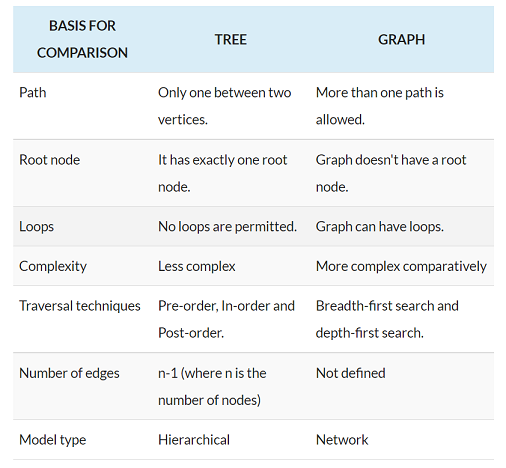

Key Differences Between Tree and Graph
In a tree there exist only one path between any two vertices whereas a graph can have unidirectional and bidirectional paths between the nodes.
In the tree, there is exactly one root node, and every child can have only one parent. As against, in a graph, there is no concept of the root node.
A tree can not have loops and self-loops while graph can have loops and self-loops.
Graphs are more complicated as it can have loops and self-loops. In contrast, trees are simple as compared to the graph.
The tree is traversed using pre-order, in-order and post-order techniques. On the other hand, for graph traversal, we use BFS (Breadth First Search) and DFS (Depth First Search).
A tree can have n-1 edges. On the contrary, in the graph, there is no predefined number of edges, and it depends on the graph.
A tree has a hierarchical structure whereas graph has a network model.
