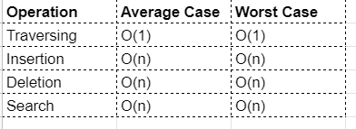
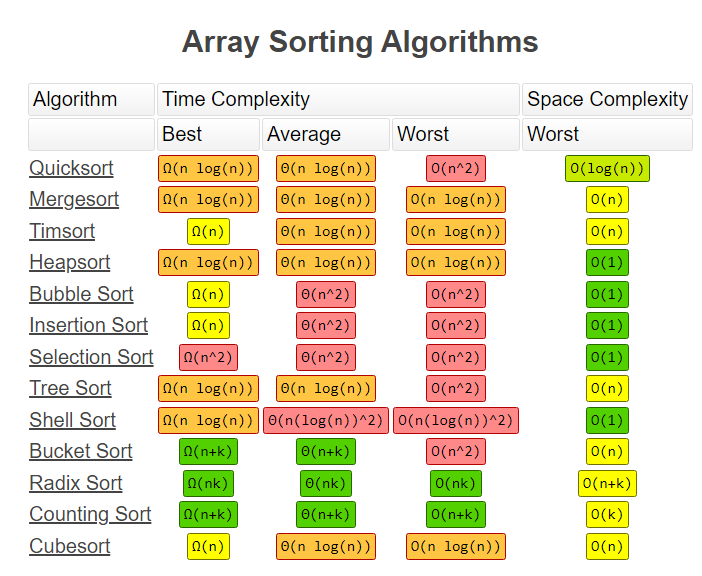

# Array Data Structure

## Overview

- Array is an ordered colection of items
- Arrays are stored in sequence of computer memory location
- Array is mostly of fixed size
- Arrays are homogeneous
- Array stores data in contiguous memory (or continuous)

## Operations
Algorithms that process data stored as arrays will typically need to visit systematically all the items in the array, and apply
appropriate operations on them.

Refer [this article](https://medium.com/codeconvention/learn-array-data-structure-2fa01edd21c2) for operations of Arrays and their time complexity

Credit : https://www.bigocheatsheet.com/

## When to Use
- Iteration and accessing individual items is performed more frequently than insertion or deletion
- Insertion and deletion especially from middle of or beginning of an array need to shift all elements following that index and hence is a costly operation
- Suitable For Look up tables 
- Search could be time consuming

## Pros and Cons

#### Pros:
- Fast lookup
- Ordered
- Fast push / pop

#### Cons:
- The number of elements to be stored in an array should be known in advance.
- SLow inserts / slow deletes
- Linear Complexity for insertion and deletion
- The Array has a fixed size (not talking about Dynamic Array and Python and Javascript like languages)
- In efficient memory allocation / utiization

### Alternate
-  Linked List: 
    - Faster insertion and deletion
    - Faster memory allocation / utilization
    - Additional memory needed for storing node information
    - Slower traversal and search
    
-  Dynamic arrays :If the number of items to be added to the dynamic array exceeds the current limit:
    - Create a copy of the array, twice the size
    - Copy items from original array into new array
    - Update array pointer to point to new dynamic array
    - Dispose of the old array

## Resources
- https://www.inoutcode.com/data-structures/arrays/
