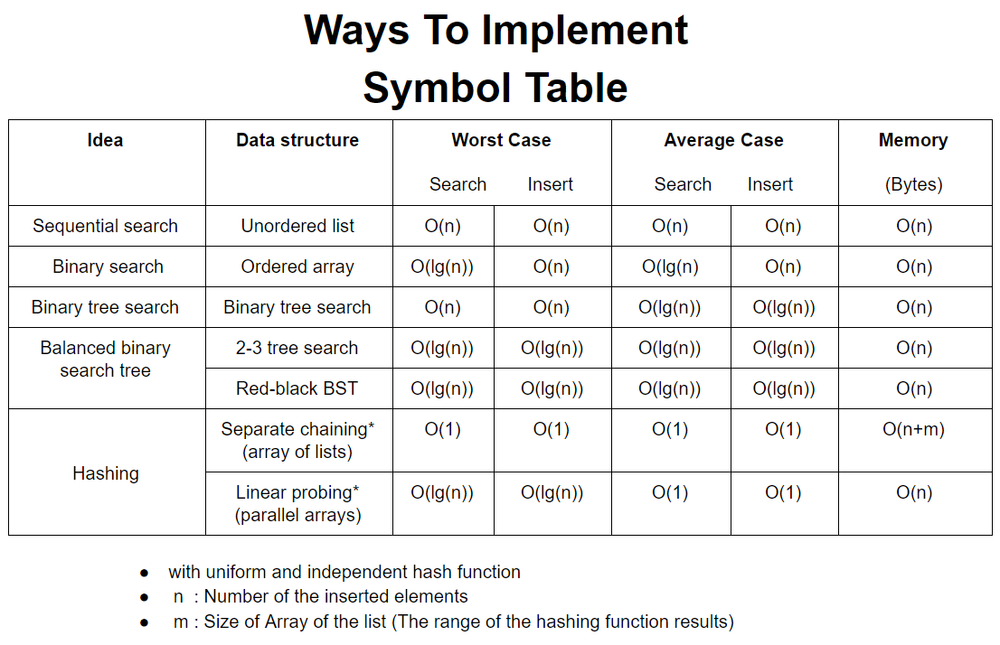

# Map Data Structure
Map is a ADT Also called Associative arrays, Symbol table or Dictionary

## Overview
- A Map is a Abstract data type, can be implemented with
  - Arrays (Vector, ArrayList)
 - Linked-list (O(n))
 - Binary search trees
 - Hash tables (O(1)) refer for details about hashing (http://www.bowdoin.edu/~ltoma/teaching/cs210/fall09/Slides/Maps.pdf)
- The ''key'' is an identifier for some kind of data, and the ''value'' is the content that is being identified or saved. 
- A Map is a type of fast key lookup data structure that offers a flexible means of indexing into its individual elements.
- Indices into the elements of a Map are called keys. These keys, along with the data values associated with them, are stored within the Map. 
- Each entry of a Map contains exactly one unique key and its corresponding value. 

## Operations

## When to Use

## Pros and Cons

#### Pros:

#### Cons:

### Alternate

## Resources

